===============================
Demo: Using Computer Vision API
===============================

This explanation demonstrates how to interact Azure `Computer Vision
<https://azure.microsoft.com/en-us/services/cognitive-services/computer-vision/>`_ APIs.

Setting environments and keys
=============================

Account Setup
-------------

To follow this demo, you need an Azure account. If you do not have an Azure account,
you may activate an Azure free trial at
`https://azure.microsoft.com/en-us/free/ <https://azure.microsoft.com/en-us/free/>`_.

Environment Setup
-----------------

.. note::

  Internet Explorer is not well supported. We recommend to use Edge, Firefox,
  or Chrome.

In `Azure Portal <https://portal.azure.com>`_, click the
``+ Create a resource`` button, enter ``computer vision`` in the search box
and choose ``Computer Vision``:

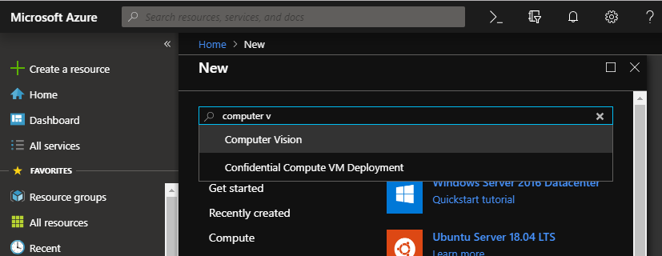

.. note::
  Select ``West US`` region or it will not work!!
  More information on supported region is available `here
  <https://docs.microsoft.com/en-us/azure/cognitive-services/Computer-vision/Vision-API-How-to-Topics/HowToSubscribe>`_

After your resource is created, you can find API keys on ``Keys`` menu in
``RESOURCE MANAGEMENT``. Copy one of two keys (``KEY 1`` should be fine),
and paste into a text editor such as Notepad for further use.

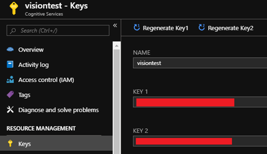

``Endpoint`` is also important. Copy and paste your endpoint from ``Overview``
menu.

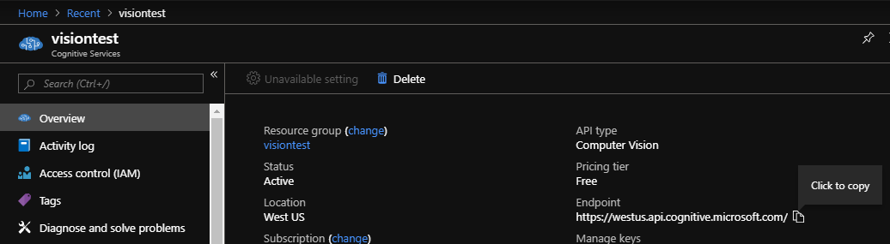

Using REST APIs
===============

API Testing Console
-------------------

API Testing Console is available through `Computer Vision API reference
<https://go.microsoft.com/fwlink/?linkid=848312>`_. This link can be found
through ``Quick start`` menu on Azure Portal.

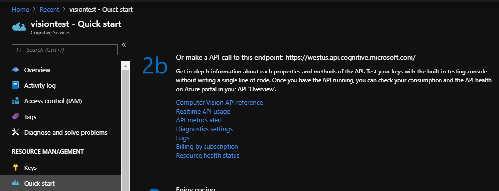

Then click ``West US`` (since we created our resource on West US region)
on ``Open API testing console`` part below.

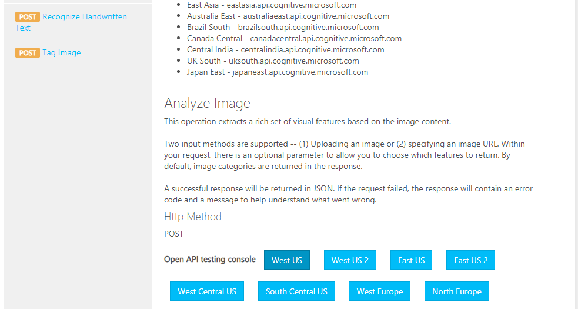

Paste your API key previously copied from Azure portal into
``Ocp-Apim-Subscription-Key`` part.

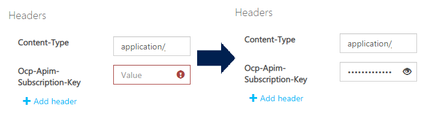

Then, replace an URL in ``Request body`` section with an image URL what
you want to test. The image size should not exceed 4MB. Below is my demo
with a test image.

.. code-block:: none
  
  {"url":"https://korea.azurebootcamp.net/assets/images/bg-ticket.jpg"}

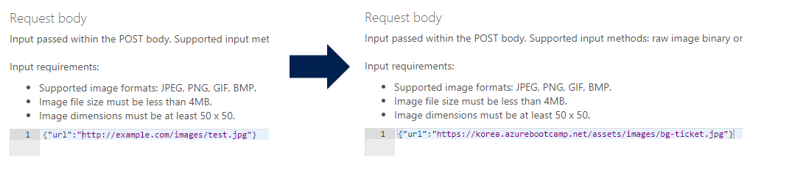

Finally, click ``Send`` button and see the result!

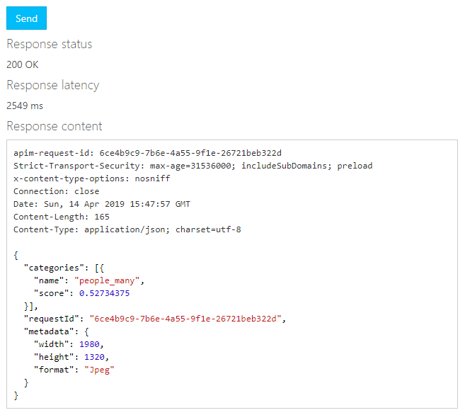

You can more try different ``visualFeatures`` Query Parameter,
and with other images how Computer Vision API works well.

Python SDK on Azure Notebooks
=============================

`Microsoft Azure Notebooks <https://notebooks.azure.com/>`_ will be your
perfect tool if you would like to developer your AI application using Python.
Azure Notebooks support to create your own `Jupyter Notebook
<https://jupyter.org/>`_ files on Azure cloud without local installation.

First, visit `Microsoft Azure Notebooks <https://notebooks.azure.com/>`_,
(follow an instruction if you first visit the site, and) click ``My Projects``.

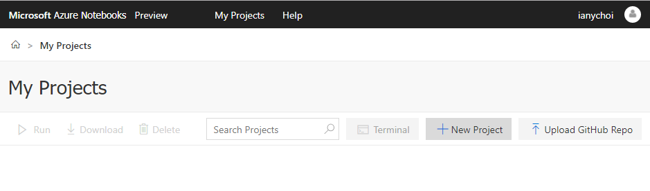

``Project Name`` should be unique, and you can set project status to ``Public``
or ``Private``. Finally, click ``Create`` button.

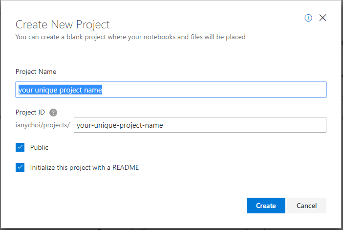

From now, you can create your own notebook by clicking ``New`` button, but
for demonstration purpose, I already created `a notebook file
<https://github.com/ianychoi/Demos/blob/master/Azure/20190415-Computer_Vision_API_webinar/computervisiontest.ipynb>`_
for the demo. Click ``Upload`` button, and then choose ``From URL`` button.

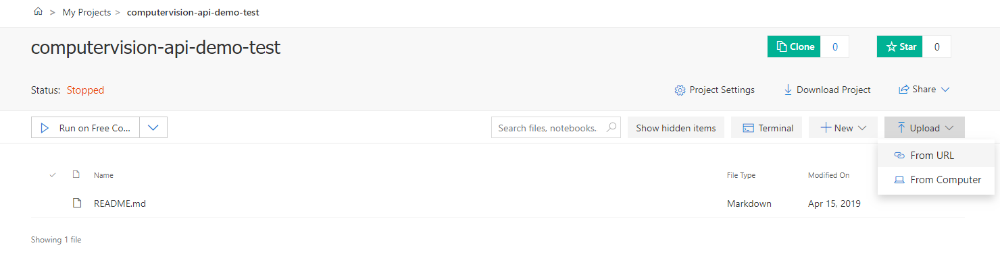

Then, copy & paste the following URL:

.. code-block:: none

  https://raw.githubusercontent.com/ianychoi/Demos/master/Azure/20190415-Computer_Vision_API_webinar/computervisiontest.ipynb

File Name part will be automatically shown. Click ``Done`` button.

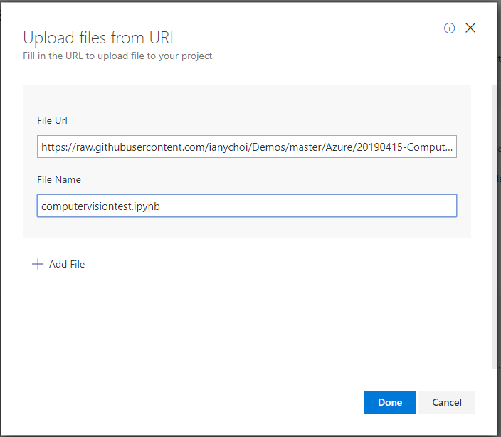

Then, click ``computervisiontest.ipynb`` file, and follow the instruction
on the notebook file!

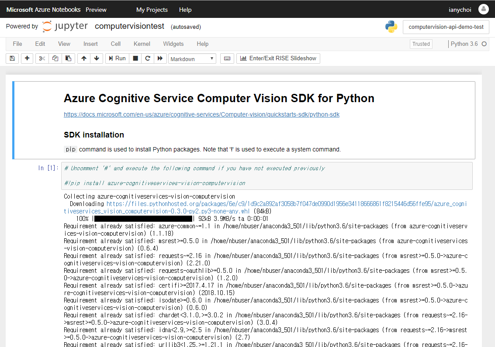
